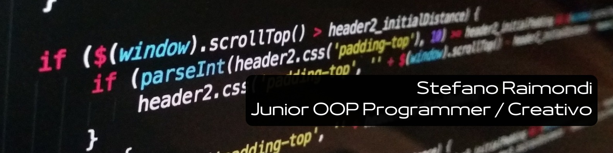

# 👋 Ciao, sono Stefano Raimondi

🎓 Sviluppatore appassionato di tecnologia, con solide basi in Java, Python e SQL.  
🎯 Sempre alla ricerca di nuove sfide per migliorarmi e contribuire a progetti innovativi.

---

## 🧠 Esperienze

Durante il mio percorso formativo e i progetti personali, ho approfondito diverse aree dello sviluppo software:

- **Java**: sviluppo web con focus su **Spring** e **Angular** per creare applicazioni modulari e scalabili.
- **SQL**: utilizzo di **JDBC** per interfacciarsi con database relazionali; esperienza con **viste**, **procedure** e **trigger**.
- **Python**: analisi dati con **NumPy**, **Pandas**, **Matplotlib**, **Seaborn**; progetti strutturati e simulazioni interattive.
- Ho creato pipeline per simulare dati reali (es. affluenza in un parco), analizzandoli tramite grafici e resampling.
- Applicazione di concetti avanzati di OOP: classi astratte, ereditarietà, strutture modulari anche in ambito videoludico.

---

## 🛠️ Competenze Tecniche

### 🧾 Linguaggi
`Java`, `Python`, `SQL`

### ⚙️ Framework & Librerie
- **Java**: Spring, Angular  
- **Python**: NumPy, Pandas, Matplotlib, Seaborn  
- **SQL**: Progettazione DB, JDBC, viste, trigger, procedure

### 💡 Altri concetti chiave
- Programmazione Orientata agli Oggetti (OOP)  
- Analisi e visualizzazione dati  
- Gestione di progetti multi-file  
- Script automatizzati per analisi/reporting

---

## 📂 Progetti

Ecco alcuni progetti a cui ho lavorato:

- 🔗 [**CV Web**](https://github.com/StefanoRaimondi-prog/Progetto-CV-Web)  
  Versione digitale e responsive del mio CV, sviluppata con HTML, CSS e TypeScript.

- 🔗 [**Analisi Dati Pokémon**](https://github.com/StefanoRaimondi-prog/Progetto-DB-Pokemon)  
  Analisi su dataset relazionali e visualizzazione con Matplotlib e Pandas.

- 🔗 [**Gioco Souls-like in Python**](https://github.com/StefanoRaimondi-prog/Progetto-DarkSouls)  
  Videogioco testuale ispirato a Dark Souls, con combattimenti, NPC e classi astratte.

- 🔗 [**Simulazione Fifa in Python**](https://github.com/StefanoRaimondi-prog/Esercitazioni_Accademy-Corso-Pyton-/tree/main/14_04_2025/Fifa.py)  
  Videogioco testuale ispirato a FIFA, con squadre, gol randomici e gestione tramite classi.

---

## 🎯 Obiettivi e Interessi

Sono motivato da una forte curiosità e voglia di imparare.  
Amo lavorare su progetti che uniscono **creatività**, **logica** e **impatto reale**.  
Se hai un progetto interessante, **contattami**: potremmo costruire qualcosa di grande insieme.

---

## 📬 Contatti

---

Grazie per aver visitato il mio profilo!  
🌟 Continua a seguirmi per aggiornamenti sui miei progetti e sulla mia crescita come sviluppatore.
